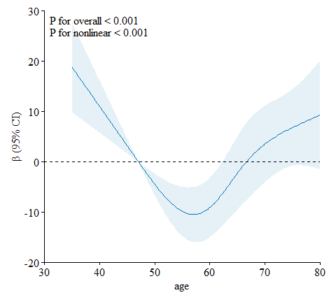
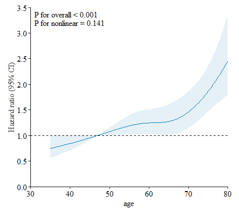

plotRCS
================
Author by Rongrui Huo

# Description

Simple drawing of restricted cubic spline (RCS) curves through
‘**ggplot2**’ package from a linear regression model, a logistic
regression model or a Cox proportional hazards regression model.

# Installation

The stable release version can be installed directly from CRAN using:

``` r
install.packages("plotRCS")
```

Alternatively, the development version can be installed using the
**devtools** R-Package:

``` r
# Install devtools (if you do not have it already)
install.packages("devtools")

devtools::install_github("kunhuo/plotRCS")
```

or the **remotes** R-Package:

``` r
install.packages("remotes")

remotes::install_github("kunhuo/plotRCS")
```

# Bug Reports and Feature Requests

If you encounter any bugs or have any specific feature requests, please
file an [Issue](https://github.com/KunHuo/plotRCS/issues).

# Examples

## RCS curves for a linear regression model

``` r
library(plotRCS)

# View data
head(cancer)
```

    ##      id age    sex  race size metastasis   status time
    ## 1 10274  53   Male White   27         No Censored   12
    ## 2 56998  32   Male Black  185         No     Dead    5
    ## 3 60010  69   Male White   51         No     Dead   13
    ## 4 24307  61   Male White   37         No Censored   50
    ## 5  5253  53 Female White   25         No Censored   27
    ## 6 39685  56   Male Other   38         No Censored   17

``` r
# RCS curves for a liear regression model
rcsplot(data = cancer,
        outcome = "size",
        exposure = "age",
        covariates = c("sex", "race", "metastasis"))
```

    ## 
    ## Figure: Association Between age and size Using a Restricted Cubic Spline Regression Model.
    ## Graphs show β for size according to age adjusted for sex, race, metastasis. Data were fitted by a linear regression model, and the model was conducted with 4 knots at the 5th, 35th, 65th, 95th percentiles of age (reference is the 5th percentile). Solid lines indicate β, and shadow shape indicate 95% CIs. CI, confidence interval.

<!-- -->

## RCS curves for a logistic regression model

``` r
# RCS curves for a logistic regression model
rcsplot(data = cancer,
        outcome = "status",
        exposure = "age",
        covariates = c("sex", "race", "size", "metastasis"))
```

    ## 
    ## Figure: Association Between age and status Using a Restricted Cubic Spline Regression Model.
    ## Graphs show ORs for status according to age adjusted for sex, race, size, metastasis. Data were fitted by a logistic regression model, and the model was conducted with 4 knots at the 5th, 35th, 65th, 95th percentiles of age (reference is the 5th percentile). Solid lines indicate ORs, and shadow shape indicate 95% CIs. OR, odds ratio; CI, confidence interval.

<!-- -->

## RCS curves for a Cox regression model

``` r
rcsplot(data = cancer,
        outcome = "status",
        time = "time",
        exposure = "age",
        covariates = c("sex", "race", "size", "metastasis"))
```

    ## 
    ## Figure: Association Between age and status Using a Restricted Cubic Spline Regression Model.
    ## Graphs show HRs for status according to age adjusted for sex, race, size, metastasis. Data were fitted by a restricted cubic spline Cox proportional hazards regression model, and the model was conducted with 4 knots at the 5th, 35th, 65th, 95th percentiles of age (reference is the 5th percentile). Solid lines indicate HRs, and shadow shape indicate 95% CIs. HR, hazard ratio; CI, confidence interval.

<!-- -->
