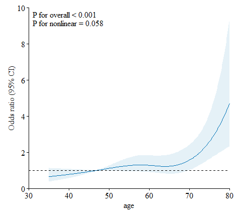

Introduction to plotRCS
================

# Installation

This version of plotRCS package for R is developmetal, and may not be
available from the CRAN. You can install it using one of the following
way.

**Direct installation from github**

You first need to install the devtools package to do the following. You
can choose from the latest stable version and the latest development
version.

``` r
# Install devtools (if you do not have it already)
install.packages("devtools")

devtools::install_github("kunhuo/plotRCS")
```

**Direct installation from CRAN**

``` r
install.packages("plotRCS")
```

# RCS curves for a logistic regression model

``` r
library(plotRCS)

# View data
head(cancer)
```

    ##      id age    sex  race size metastasis   status time
    ## 1 10274  53   Male White   27         No Censored   12
    ## 2 56998  32   Male Black  185         No     Dead    5
    ## 3 60010  69   Male White   51         No     Dead   13
    ## 4 24307  61   Male White   37         No Censored   50
    ## 5  5253  53 Female White   25         No Censored   27
    ## 6 39685  56   Male Other   38         No Censored   17

``` r
# RCS curves for a logistic regression model
rcsplot(data = cancer,
        outcome = "status",
        exposure = "age",
        covariates = c("sex", "race", "size", "metastasis"))
```

    ## 
    ## Figure: Association Between age and status Using a Restricted Cubic Spline Regression Model.
    ## Graphs show ORs for status according to age adjusted for sex, race, size, metastasis. Data were fitted by a logistic regression model, and the model was conducted with 4 knots at the 5th, 35th, 65th, 95th percentiles of age (reference is the 5th percentile). Solid lines indicate ORs, and shadow shape indicate 95% CIs. OR, odds ratio; CI, confidence interval.

<!-- -->
